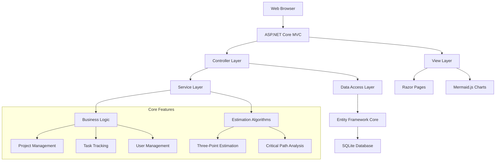
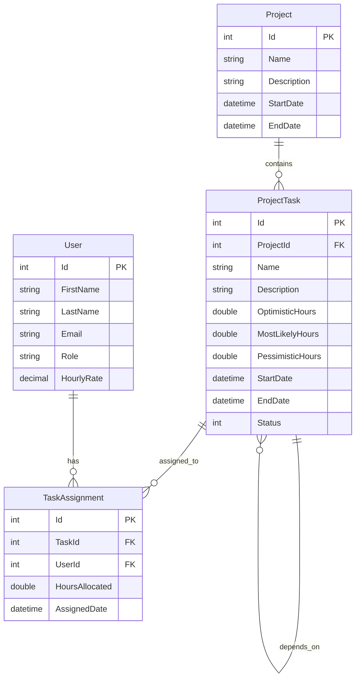

# Developer Onboarding Guide - CU3627 Gen AI Course

[](./LICENSE)
[](https://dotnet.microsoft.com/)
[](https://docs.microsoft.com/en-us/ef/)

## 🎯 Project Overview

This repository contains educational materials and demo applications for the **GitHub Copilot & Generative AI for Developers (CU3627)** course. The primary focus is teaching AI-assisted development workflows using practical C#/.NET applications.

### Main Components

- **ProjectEstimator**: A full-featured ASP.NET Core web application for project management and estimation
- **TaskManager**: Console-based task management system (starter project)
- **InventorySystem**: Inventory tracking application demo
- **DataParser**: Data processing and parsing utilities
- **Course Materials**: Interactive exercises and documentation

## 🏗️ Architecture Overview

### ProjectEstimator (Main Application)

```
┌─────────────────────────────────────────────────────────┐
│                    ASP.NET Core MVC                     │
├─────────────────────────────────────────────────────────┤
│  Controllers     │  Views          │  Models           │
│  - HomeController│  - Razor Pages  │  - Project        │
│  - TasksController│ - Shared Layout │  - ProjectTask    │
│  - UsersController│ - Components    │  - User           │
│                  │                 │  - TaskAssignment │
├─────────────────────────────────────────────────────────┤
│  Services                          │  Data Layer       │
│  - EstimationService              │  - ApplicationDbContext │
│  - MermaidService                 │  - Entity Framework │
│  - Three-point estimation         │  - SQLite Database │
│  - Critical path calculation      │  - Migrations      │
├─────────────────────────────────────────────────────────┤
│                    Infrastructure                       │
│  - SQLite Database                                     │
│  - Mermaid.js (Gantt Charts)                          │
│  - Bootstrap UI Framework                              │
└─────────────────────────────────────────────────────────┘
```

### System Architecture



## 🛠️ Technology Stack

### Core Technologies
- **.NET 9.0**: Main framework
- **ASP.NET Core MVC**: Web framework
- **Entity Framework Core 8.0**: ORM
- **SQLite**: Database
- **C# 12**: Programming language

### Frontend Technologies
- **Razor Pages**: Server-side rendering
- **Bootstrap**: CSS framework
- **Mermaid.js**: Gantt chart generation
- **HTML5/CSS3/JavaScript**: Standard web technologies

### Development Tools
- **Visual Studio Code**: Primary IDE
- **GitHub Copilot**: AI coding assistant
- **NUnit**: Testing framework
- **FluentAssertions**: Assertion library

### Testing & Quality
- **NUnit 4.0.1**: Unit testing framework
- **Entity Framework InMemory**: Test database
- **FluentAssertions 6.12.0**: Readable assertions
- **Microsoft.NET.Test.Sdk**: Testing infrastructure

## 🚀 Getting Started

### Prerequisites

1. **.NET 9.0 SDK** - [Download here](https://dotnet.microsoft.com/download)
2. **Visual Studio Code** - [Download here](https://code.visualstudio.com/)
3. **GitHub Copilot Extension** - Install from VS Code marketplace
4. **Git** - [Download here](https://git-scm.com/)

### Environment Setup

1. **Clone the repository**
   ```powershell
   git clone https://github.com/dvwl/cu3627-gen-ai-course.git
   cd cu3627-gen-ai-course
   ```

2. **Verify .NET installation**
   ```powershell
   dotnet --version
   # Should show 9.0.x or higher
   ```

3. **Restore dependencies**
   ```powershell
   dotnet restore
   ```

4. **Build the solution**
   ```powershell
   dotnet build
   ```

### Running the ProjectEstimator Application

1. **Navigate to the project directory**
   ```powershell
   cd demos/ProjectEstimator
   ```

2. **Run database migrations**
   ```powershell
   dotnet ef database update
   ```

3. **Start the application**
   ```powershell
   dotnet run
   ```

4. **Access the application**
   - Open browser to `https://localhost:5001` or `http://localhost:5000`
   - The application will seed with sample data automatically

### Project Structure

```
cu3627-gen-ai-course/
├── demos/                          # Demo applications
│   ├── ProjectEstimator/           # Main web application
│   │   ├── Controllers/            # MVC controllers
│   │   ├── Models/                 # Data models
│   │   ├── Views/                  # Razor view templates
│   │   ├── Services/               # Business logic services
│   │   ├── Data/                   # Data access layer
│   │   ├── Migrations/             # EF Core migrations
│   │   ├── Tests/                  # Unit and integration tests
│   │   └── wwwroot/                # Static web assets
│   ├── TaskManager/                # Console task manager
│   ├── InventorySystem/            # Inventory demo
│   └── DataParser/                 # Data processing demo
├── exercises/                      # Course exercises
│   ├── module1/                    # Module 1 labs
│   └── module2/                    # Module 2 labs
└── docs/                           # Course documentation
```

## 🧪 Testing Guidelines

### Test Strategy

The project follows a comprehensive testing approach:

1. **Unit Tests**: Test individual components in isolation
2. **Integration Tests**: Test component interactions
3. **Model Tests**: Validate business logic and data models

### Running Tests

```powershell
# Run all tests
dotnet test

# Run tests with coverage
dotnet test --collect:"XPlat Code Coverage"

# Run specific test project
dotnet test demos/ProjectEstimator/Tests/
```

### Test Structure

```
Tests/
├── Helpers/
│   ├── TestDbContextFactory.cs    # Database context for testing
│   └── TestDataBuilder.cs         # Test data creation utilities
└── Models/
    ├── UserTests.cs                        # User model tests
    ├── TaskAssignmentTests.cs              # Task assignment tests
    └── UserTaskAssignmentIntegrationTests.cs # Integration tests
```

### Writing Tests

- Use **NUnit** for test framework
- Use **FluentAssertions** for readable assertions
- Use **InMemory database** for data layer testing
- Follow **Arrange-Act-Assert** pattern

Example test:
```csharp
[Test]
public void CalculateThreePointEstimate_ShouldReturnCorrectExpectedValue()
{
    // Arrange
    var service = new EstimationService();
    
    // Act
    var result = service.CalculateThreePointEstimate(2, 4, 8);
    
    // Assert
    result.Expected.Should().BeApproximately(4.33, 0.01);
}
```

## 📊 Database Schema

### Core Entities



### Database Migrations

```powershell
# Create new migration
dotnet ef migrations add MigrationName

# Update database
dotnet ef database update

# Rollback migration
dotnet ef database update PreviousMigrationName
```

## 🎨 Design Guidelines

### Code Style

- Follow **C# Coding Conventions**
- Use **PascalCase** for public members
- Use **camelCase** for private fields
- Use **meaningful names** for variables and methods
- Keep methods **small and focused**

### Architecture Principles

1. **Separation of Concerns**: Clear separation between controllers, services, and data access
2. **Dependency Injection**: Use built-in DI container
3. **Single Responsibility**: Each class should have one reason to change
4. **Interface Segregation**: Prefer small, focused interfaces

### File Organization

- **Controllers**: Handle HTTP requests and responses only
- **Services**: Contain business logic and calculations
- **Models**: Define data structures and validation
- **Views**: Handle presentation logic only

## 🔄 Version Control

### Git Workflow

1. **Main Branch**: Production-ready code
2. **Feature Branches**: New feature development
3. **Pull Requests**: Code review process

### Branching Strategy

```
main
├── feature/project-estimation-enhancements
├── feature/user-management
└── bugfix/critical-path-calculation
```

### Commit Guidelines

- Use **conventional commits**: `feat:`, `fix:`, `docs:`, `test:`
- Write **descriptive commit messages**
- Keep commits **atomic** and focused

Example:
```
feat: add three-point estimation calculation
fix: resolve critical path algorithm bug
docs: update API documentation
test: add unit tests for estimation service
```

## 🚀 Continuous Integration & Deployment

### GitHub Actions Workflow (Recommended)

Create `.github/workflows/ci.yml`:

```yaml
name: CI/CD Pipeline

on:
  push:
    branches: [ main, develop ]
  pull_request:
    branches: [ main ]

jobs:
  build:
    runs-on: ubuntu-latest
    
    steps:
    - uses: actions/checkout@v3
    
    - name: Setup .NET
      uses: actions/setup-dotnet@v3
      with:
        dotnet-version: '9.0.x'
        
    - name: Restore dependencies
      run: dotnet restore
      
    - name: Build
      run: dotnet build --no-restore
      
    - name: Test
      run: dotnet test --no-build --verbosity normal
      
    - name: Publish
      run: dotnet publish -c Release -o ./publish
```

### Deployment Checklist

1. **Build passes** all tests
2. **Database migrations** are up to date
3. **Configuration** is environment-specific
4. **Dependencies** are properly versioned
5. **Health checks** are implemented

## 🔧 Development Workflow

### Daily Development

1. **Pull latest changes** from main branch
2. **Create feature branch** for new work
3. **Write tests first** (TDD approach recommended)
4. **Implement features** using GitHub Copilot assistance
5. **Run tests** to ensure functionality
6. **Commit and push** changes
7. **Create pull request** for review

### Using GitHub Copilot

- Use **descriptive comments** to guide Copilot
- Write **function signatures** before implementation
- Use **examples** in comments for complex logic
- **Review generated code** thoroughly
- **Test all Copilot suggestions** before committing

Example Copilot usage:
```csharp
// Calculate the expected duration using PERT three-point estimation
// Formula: (optimistic + 4 * mostLikely + pessimistic) / 6
public double CalculateExpectedDuration(double optimistic, double mostLikely, double pessimistic)
{
    // Copilot will suggest the implementation
}
```

## 🛠️ Infrastructure

### Development Environment

- **Local Database**: SQLite (included in repository)
- **Web Server**: Kestrel (built into .NET)
- **Port Configuration**: 5000 (HTTP), 5001 (HTTPS)

### Production Considerations

- **Database**: Consider PostgreSQL or SQL Server for production
- **Hosting**: Azure App Service, AWS, or similar
- **Configuration**: Use environment variables
- **Monitoring**: Application Insights or similar
- **Security**: HTTPS, authentication, authorization

## 📚 Additional Resources

### Documentation

- [ASP.NET Core Documentation](https://docs.microsoft.com/en-us/aspnet/core/)
- [Entity Framework Core Documentation](https://docs.microsoft.com/en-us/ef/core/)
- [GitHub Copilot Documentation](https://docs.github.com/en/copilot)

### Learning Materials

- [Course Materials Online](https://dvwl.github.io/cu3627-gen-ai-course/)
- [.NET Learning Path](https://docs.microsoft.com/en-us/learn/dotnet/)
- [C# Programming Guide](https://docs.microsoft.com/en-us/dotnet/csharp/)

## 🤝 Contributing

### Code Review Process

1. **Create feature branch** from main
2. **Implement changes** with tests
3. **Submit pull request** with description
4. **Address review feedback**
5. **Merge after approval**

### Quality Standards

- **Code coverage** should be above 80%
- **All tests** must pass
- **No compiler warnings**
- **Follow coding standards**
- **Update documentation** as needed

## 🐛 Troubleshooting

### Common Issues

1. **Build Failures**
   ```powershell
   dotnet clean
   dotnet restore
   dotnet build
   ```

2. **Database Issues**
   ```powershell
   dotnet ef database drop
   dotnet ef database update
   ```

3. **Port Conflicts**
   - Check `launchSettings.json` for port configuration
   - Use `netstat -an | findstr :5000` to check port usage

4. **Package Conflicts**
   ```powershell
   dotnet restore --force
   ```

### Getting Help

- **Course Instructor**: Daniel Vong
- **GitHub Issues**: Create issue in repository
- **Stack Overflow**: Tag with `asp.net-core` and `entity-framework`

## 📄 License

This project is licensed under the MIT License - see the [LICENSE](./LICENSE) file for details.

---

**Last Updated**: October 2025  
**Maintainer**: DreamCatcher Consulting Sdn Bhd  
**Course Code**: CU3627