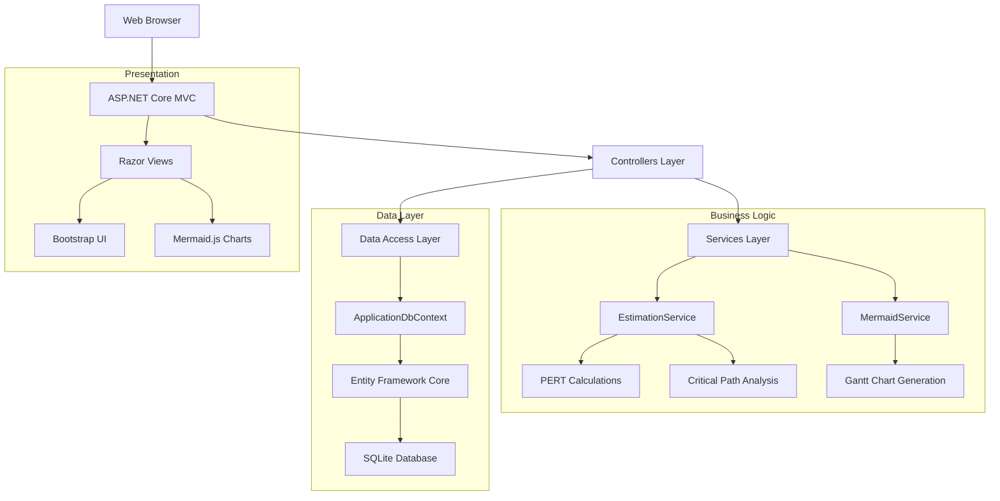
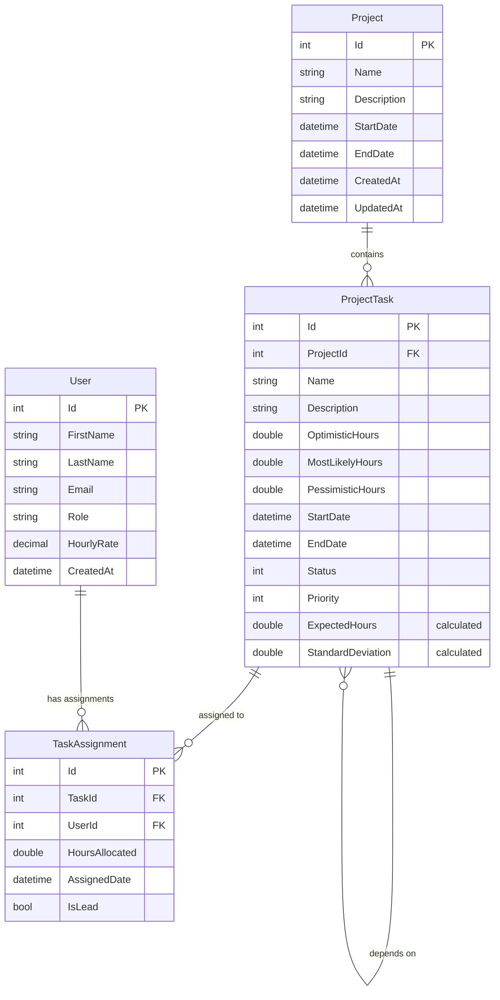
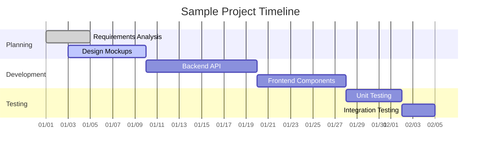

# ProjectEstimator - Project Management & Estimation Tool

[](https://dotnet.microsoft.com/)
[](https://docs.microsoft.com/en-us/ef/)
[](../../../LICENSE)

## 🎯 Project Overview

ProjectEstimator is a comprehensive web-based project management and estimation tool built with ASP.NET Core. It provides advanced project planning capabilities including three-point estimation, task dependency management, team assignment, and automated Gantt chart generation using Mermaid.js.

### Key Features

- **🔢 Three-Point Estimation**: PERT-based estimation with optimistic, most likely, and pessimistic scenarios
- **📋 Task Management**: Complete CRUD operations for project tasks with status tracking
- **👥 Team Management**: User assignment and role-based task allocation
- **🔗 Dependency Tracking**: Define and visualize task dependencies and critical paths
- **📊 Gantt Charts**: Automated Mermaid.js chart generation and visualization
- **📈 Project Analytics**: Confidence intervals, variance analysis, and timeline projections
- **💾 Data Persistence**: SQLite database with Entity Framework Core
- **📱 Responsive Design**: Bootstrap-powered responsive UI

## 🏗️ Architecture

### Application Structure

```
ProjectEstimator/
├── Controllers/           # MVC Controllers
│   ├── HomeController.cs    # Dashboard and main navigation
│   ├── TasksController.cs   # Task CRUD operations
│   └── UsersController.cs   # User and team management
├── Models/               # Data Models & ViewModels
│   ├── Project.cs          # Project entity
│   ├── ProjectTask.cs      # Task entity with estimation
│   ├── User.cs             # User/personnel entity
│   └── TaskAssignment.cs   # Many-to-many task assignments
├── Views/                # Razor View Templates
│   ├── Home/               # Dashboard views
│   ├── Tasks/              # Task management UI
│   ├── Users/              # User management UI
│   └── Shared/             # Layout and shared components
├── Services/             # Business Logic Layer
│   ├── EstimationService.cs # PERT calculations & analytics
│   └── MermaidService.cs   # Gantt chart generation
├── Data/                 # Data Access Layer
│   ├── ApplicationDbContext.cs # EF Core context
│   └── SeedData.cs         # Initial data seeding
├── Migrations/           # EF Core database migrations
├── Tests/                # Unit and integration tests
├── wwwroot/              # Static web assets
└── appsettings.json      # Application configuration
```

### System Architecture



## 🛠️ Technology Stack

### Core Technologies
- **.NET 9.0**: Application framework
- **ASP.NET Core MVC**: Web framework with Model-View-Controller pattern
- **Entity Framework Core 8.0**: Object-Relational Mapping (ORM)
- **SQLite**: Lightweight, embedded database
- **C# 12**: Programming language with latest features

### Frontend Technologies
- **Razor Pages**: Server-side HTML generation
- **Bootstrap 5**: Responsive CSS framework
- **Mermaid.js**: Dynamic chart and diagram generation
- **HTML5/CSS3/JavaScript**: Standard web technologies

### Development & Testing
- **NUnit 4.0.1**: Unit testing framework
- **FluentAssertions 6.12.0**: Fluent assertion library
- **Entity Framework InMemory**: In-memory database for testing
- **Microsoft.NET.Test.Sdk**: Testing infrastructure

### Dependencies
```xml
<PackageReference Include="Microsoft.EntityFrameworkCore.Design" Version="8.0.0" />
<PackageReference Include="Microsoft.EntityFrameworkCore.Sqlite" Version="8.0.0" />
<PackageReference Include="Microsoft.EntityFrameworkCore.Tools" Version="8.0.0" />
<PackageReference Include="NUnit" Version="4.0.1" />
<PackageReference Include="NUnit3TestAdapter" Version="4.5.0" />
<PackageReference Include="Microsoft.NET.Test.Sdk" Version="17.8.0" />
<PackageReference Include="Microsoft.EntityFrameworkCore.InMemory" Version="8.0.0" />
<PackageReference Include="FluentAssertions" Version="6.12.0" />
```

## 🚀 Getting Started

### Prerequisites

- **.NET 9.0 SDK** - [Download here](https://dotnet.microsoft.com/download)
- **Visual Studio Code** or **Visual Studio 2022**
- **Git** for version control

### Installation & Setup

1. **Clone or navigate to the project**
   ```powershell
   cd demos/ProjectEstimator
   ```

2. **Restore NuGet packages**
   ```powershell
   dotnet restore
   ```

3. **Build the application**
   ```powershell
   dotnet build
   ```

4. **Run database migrations**
   ```powershell
   dotnet ef database update
   ```

5. **Start the application**
   ```powershell
   dotnet run
   ```

6. **Access the application**
   - Navigate to `https://localhost:5001` or `http://localhost:5000`
   - The application will automatically seed with sample data

### Configuration

The application uses `appsettings.json` for configuration:

```json
{
  "ConnectionStrings": {
    "DefaultConnection": "Data Source=project_estimator.db"
  },
  "Logging": {
    "LogLevel": {
      "Default": "Information",
      "Microsoft.AspNetCore": "Warning"
    }
  }
}
```

## 📊 Database Schema

### Entity Relationship Diagram



### Core Models

#### Project
- Primary container for tasks and project-level information
- Calculated properties for total hours and project metrics
- Automatic timeline calculation based on task dependencies

#### ProjectTask
- Individual work items with three-point estimation
- PERT calculation for expected hours and standard deviation
- Status tracking (Not Started, In Progress, Completed, Blocked)
- Priority ordering for Gantt chart display

#### User
- Team members who can be assigned to tasks
- Role-based classification (Developer, Designer, Manager, etc.)
- Hourly rate for cost calculations

#### TaskAssignment
- Many-to-many relationship between tasks and users
- Hours allocation and leadership designation
- Assignment tracking and history

## 🧮 Estimation Features

### Three-Point Estimation (PERT)

The application implements Program Evaluation and Review Technique (PERT) for project estimation:

```csharp
// Expected Time = (Optimistic + 4 × Most Likely + Pessimistic) / 6
Expected = (optimistic + 4 * mostLikely + pessimistic) / 6;

// Standard Deviation = (Pessimistic - Optimistic) / 6
StandardDeviation = (pessimistic - optimistic) / 6;

// Confidence Intervals
ConfidenceInterval68 = Expected ± StandardDeviation;
ConfidenceInterval95 = Expected ± (2 × StandardDeviation);
```

### Estimation Service Features

- **Three-Point Calculations**: Automatic PERT formula application
- **Project Summaries**: Aggregated statistics across all tasks
- **Critical Path Analysis**: Identify project bottlenecks
- **Confidence Intervals**: 68% and 95% confidence ranges
- **Variance Analysis**: Risk assessment and uncertainty quantification

### Sample Estimation Results

| Scenario | Optimistic | Most Likely | Pessimistic | Expected | Std Dev |
|----------|------------|-------------|-------------|----------|---------|
| Simple Task | 2 hours | 4 hours | 8 hours | 4.33 hours | 1.0 hour |
| Complex Feature | 16 hours | 24 hours | 40 hours | 25.33 hours | 4.0 hours |
| Research Task | 4 hours | 12 hours | 32 hours | 14.0 hours | 4.67 hours |

## 📈 Gantt Chart Generation

### Mermaid.js Integration

The application automatically generates Gantt charts using Mermaid.js syntax:



### Chart Features

- **Automatic Generation**: Charts update based on task data
- **Status Color Coding**: Visual indicators for task progress
- **Dependency Visualization**: Clear dependency relationships
- **Timeline Calculations**: Automatic date calculations
- **Responsive Display**: Mobile-friendly chart rendering

## 🧪 Testing

### Test Strategy

The application includes comprehensive testing at multiple levels:

1. **Unit Tests**: Individual component testing
2. **Integration Tests**: Database and service interaction testing
3. **Model Tests**: Business logic and calculation validation

### Running Tests

```powershell
# Run all tests
dotnet test

# Run with detailed output
dotnet test --verbosity normal

# Run specific test project
dotnet test Tests/

# Generate coverage report
dotnet test --collect:"XPlat Code Coverage"
```

### Test Structure

```
Tests/
├── Helpers/
│   ├── TestDbContextFactory.cs    # In-memory database setup
│   └── TestDataBuilder.cs         # Test data generation
└── Models/
    ├── UserTests.cs                        # User model validation
    ├── TaskAssignmentTests.cs              # Assignment logic tests
    └── UserTaskAssignmentIntegrationTests.cs # Integration scenarios
```

### Sample Test Examples

```csharp
[Test]
public void CalculateThreePointEstimate_ShouldReturnCorrectExpectedValue()
{
    // Arrange
    var service = new EstimationService();
    
    // Act
    var result = service.CalculateThreePointEstimate(2, 4, 8);
    
    // Assert
    result.Expected.Should().BeApproximately(4.33, 0.01);
    result.StandardDeviation.Should().BeApproximately(1.0, 0.01);
}
```

## 🔧 Development Guidelines

### Code Organization

- **Controllers**: Handle HTTP requests, minimal business logic
- **Services**: Contain business logic and calculations
- **Models**: Data structures with validation attributes
- **Views**: Presentation logic only, use ViewModels for complex data

### Design Patterns

- **Repository Pattern**: Implemented via Entity Framework DbContext
- **Service Layer**: Business logic abstraction
- **Dependency Injection**: Built-in ASP.NET Core DI container
- **MVC Pattern**: Clear separation of concerns

### Best Practices

1. **Single Responsibility**: Each class has one primary purpose
2. **Interface Segregation**: Small, focused interfaces
3. **Dependency Injection**: Constructor injection for dependencies
4. **Async/Await**: Asynchronous database operations
5. **Input Validation**: Model validation attributes and custom validators

## 📚 API Endpoints

### Task Management

| Method | Endpoint | Description |
|--------|----------|-------------|
| GET | `/Tasks` | List all tasks with project information |
| GET | `/Tasks/Details/{id}` | View task details and estimations |
| GET | `/Tasks/Create` | Show task creation form |
| POST | `/Tasks/Create` | Create new task |
| GET | `/Tasks/Edit/{id}` | Show task edit form |
| POST | `/Tasks/Edit/{id}` | Update existing task |
| POST | `/Tasks/Delete/{id}` | Delete task |

### User Management

| Method | Endpoint | Description |
|--------|----------|-------------|
| GET | `/Users` | List all users/team members |
| GET | `/Users/Details/{id}` | View user profile and assignments |
| GET | `/Users/Create` | Show user creation form |
| POST | `/Users/Create` | Create new user |
| GET | `/Users/Edit/{id}` | Show user edit form |
| POST | `/Users/Edit/{id}` | Update user information |

### Project Dashboard

| Method | Endpoint | Description |
|--------|----------|-------------|
| GET | `/` | Main dashboard with project overview |
| GET | `/Home/Privacy` | Privacy policy page |
| GET | `/Home/Error` | Error handling page |

## 🔄 Database Migrations

### Managing Migrations

```powershell
# Create new migration
dotnet ef migrations add MigrationName

# Update database to latest migration
dotnet ef database update

# Rollback to specific migration
dotnet ef database update PreviousMigrationName

# Remove last migration (if not applied)
dotnet ef migrations remove

# View migration history
dotnet ef migrations list
```

### Migration History

- `InitialCreate`: Base schema with Projects, Tasks, Users, and TaskAssignments
- Future migrations will be added as the schema evolves

## 🐛 Troubleshooting

### Common Issues

1. **Build Errors**
   ```powershell
   # Clean and rebuild
   dotnet clean
   dotnet restore
   dotnet build
   ```

2. **Database Issues**
   ```powershell
   # Reset database
   dotnet ef database drop
   dotnet ef database update
   ```

3. **Port Conflicts**
   - Check `Properties/launchSettings.json` for port configuration
   - Default ports: 5000 (HTTP), 5001 (HTTPS)

4. **Missing Dependencies**
   ```powershell
   # Force package restore
   dotnet restore --force
   ```

### Debugging Tips

- Check the browser's developer console for JavaScript errors
- Review application logs in the console output
- Verify database file exists: `project_estimator.db`
- Ensure all migrations are applied: `dotnet ef migrations list`

## 🚀 Deployment

### Local Development
- SQLite database (included in repository)
- Kestrel web server (built into .NET)
- No additional setup required

### Production Considerations
- **Database**: Consider PostgreSQL or SQL Server for production
- **Configuration**: Use environment variables for sensitive data
- **HTTPS**: Ensure SSL certificates are properly configured
- **Logging**: Implement structured logging (Serilog, NLog)
- **Monitoring**: Add health checks and application monitoring

### Docker Deployment (Optional)

```dockerfile
FROM mcr.microsoft.com/dotnet/aspnet:9.0 AS base
WORKDIR /app
EXPOSE 80
EXPOSE 443

FROM mcr.microsoft.com/dotnet/sdk:9.0 AS build
WORKDIR /src
COPY ["ProjectEstimator.csproj", "."]
RUN dotnet restore "ProjectEstimator.csproj"
COPY . .
RUN dotnet build "ProjectEstimator.csproj" -c Release -o /app/build

FROM build AS publish
RUN dotnet publish "ProjectEstimator.csproj" -c Release -o /app/publish

FROM base AS final
WORKDIR /app
COPY --from=publish /app/publish .
ENTRYPOINT ["dotnet", "ProjectEstimator.dll"]
```

## 📈 Performance Considerations

### Database Optimization
- **Eager Loading**: Use `Include()` for related data
- **Async Operations**: All database calls are asynchronous
- **Indexes**: Add indexes for frequently queried columns
- **Connection Pooling**: Enabled by default in Entity Framework

### UI Performance
- **Lazy Loading**: Large datasets are paginated
- **Caching**: Consider output caching for static content
- **Minification**: CSS and JavaScript minification for production
- **CDN**: Use CDN for Bootstrap and other static assets

## 🤝 Contributing

### Development Workflow

1. **Create feature branch** from main
2. **Implement changes** with unit tests
3. **Run all tests** to ensure functionality
4. **Update documentation** as needed
5. **Submit pull request** for review

### Code Quality Standards

- **Test Coverage**: Maintain >80% code coverage
- **Code Style**: Follow C# coding conventions
- **Documentation**: Update XML comments for public APIs
- **Performance**: Profile critical paths for optimization

## 📄 License

This project is part of the CU3627 course materials and is licensed under the MIT License.

---

**Last Updated**: October 2025  
**Version**: 1.0.0  
**Maintainer**: Course Development Team